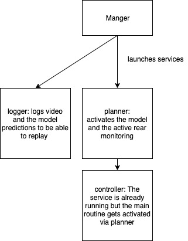

REON
================
Keep in mind the master branch(this) is the develpment branch, as soon as a working release is there, there will be a always working release branch
## System design

</img>

## TODO
* Manager (Basic functionality is already given)
* Update and lauch mechanics. Remember we are changing the standard openpilt code out with the REON one. This means we can install packages in lauch_openpilot.sh and check if they are on the newest possible version. 
* Messeging: We have to choose something like ZMQ 
* Write a logger. Video and the model answer data needs to be logged
* Further development on the model, currently yolo_small is used. Tracking and detection performance should always be imporved and it should be as good as possible for auto lane changes. Keep in mind, this is not the development of a product, this code is in its alpha version and should only be used for educational purposes only.
*
## Things you can try out on your EON right now
 * Try to install opencv-python as quickly and as nicely as possible 
 
